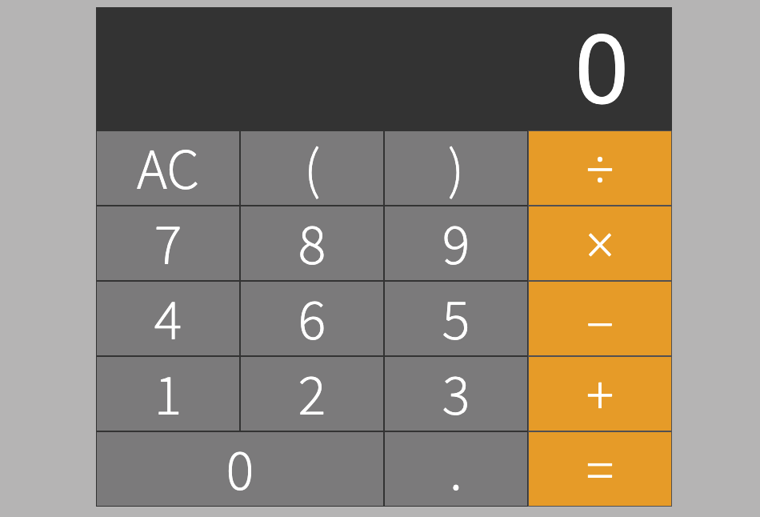

# calculator



## Table of Contents
1. [Description](#description)
2. [Requirements](#requirements)
3. [Installation](#installation)
4. [Technologies](#technologies)

## Description
- Supports positive/negative integers, floats, division [&#247;], multiplication [*], addition [+], subtraction [-], and parentheses[()].
- An operation can be created from the keyboard and/or by clicking the numeric buttons.
- Pressing [=] submits the operation to be solved, result will replace the input field (operation).
- Pressing the All Clear button [AC] clears both the input and result.


## Requirements
- Node ^6.13.0

## Installation
1. Clone repository
2. Install dependencies:
```sh
npm install
```
3. Create the bundle file:
```sh
npm run build (development mode)
```
4. Start the server:
```sh
npm start
```
5. Application available at http://localhost:1337


### Test command
```sh
npm test
```

## Technologies
- React & ReactDOM
- Node.js
- Express.js
- Axios
- CSS
- HTML
- Babel
- Webpack
- Jest
- sinful-math